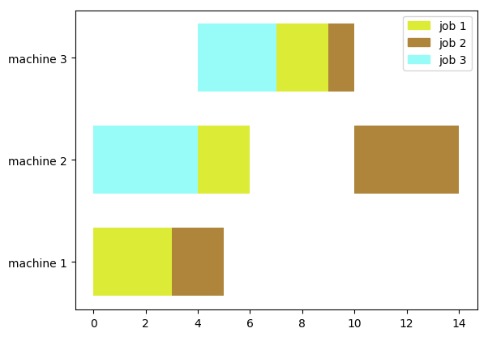
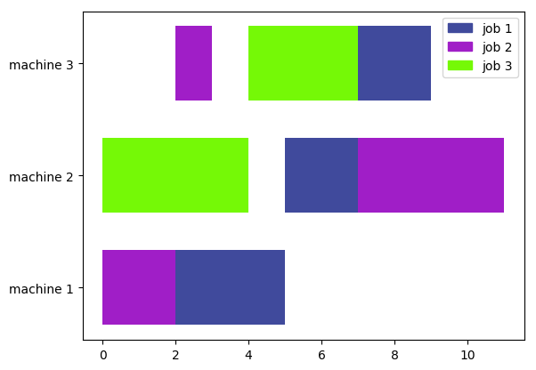
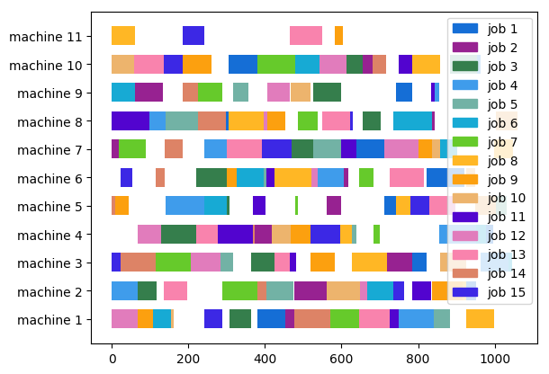

# Meta-Heuristic

## Files' structure

- In the first line there are (at least) 2 numbers: the first is the number of jobs and the second the number of machines (the 3rd is not necessary, it is the average number of machines per operation)

- Every row represents one job: the first number is the number of operations of that job, the second number (let's say k>=1) is the number of machines that can process the first operation; then according to k, there are k pairs of numbers (machine,processing time) that specify which are the machines and the processing times; then the data for the second operation and so on...

Example: Fisher and Thompson 6x6 instance, alternate name (mt06)

```
6   6   1   
6   1   3   1   1   1   3   1   2   6   1   4   7   1   6   3   1   5   6   
6   1   2   8   1   3   5   1   5   10  1   6   10  1   1   10  1   4   4   
6   1   3   5   1   4   4   1   6   8   1   1   9   1   2   1   1   5   7   
6   1   2   5   1   1   5   1   3   5   1   4   3   1   5   8   1   6   9   
6   1   3   9   1   2   3   1   5   5   1   6   4   1   1   3   1   4   1   
6   1   2   3   1   4   3   1   6   9   1   1   10  1   5   4   1   3   1   
```

first row = 6 jobs and 6 machines 1 machine per operation
second row: job 1 has 6 operations, the first operation can be processed by 1 machine that is machine 3 with processing time 1.

## Results

### Test file

**Shortest operation available:** done in 14 units of time

    Total time: 0.0033700000058161095 seconds 



**Genetic algorithm:** done in 11 units of time

    Population: 10, Max Generation: 100, Total time: 2.63803599998937 seconds




### Barnes - setb4c9

**Shortest operation available:** done in 1245 units of time

    Total time: 0.04628799999773037 seconds 


**Genetic algorithm:** done in 1158 units of time

    Population: 10, Max Generation: 300, Total time: 66.035165 seconds


